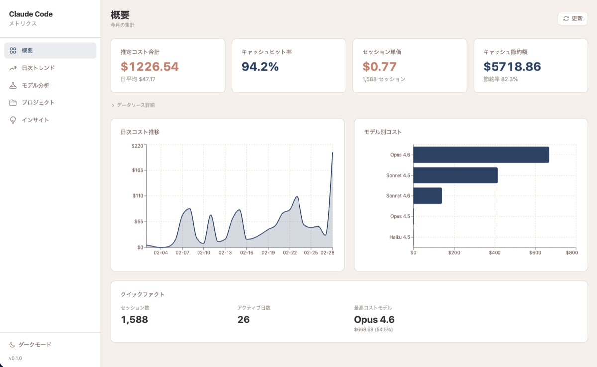

# Claude Code Metrics

Claude Code のローカル利用データ（`~/.claude`）を可視化・分析するセルフホスト型ダッシュボードです。

トークン使用量、API コスト、キャッシュ効率、プロジェクト別統計などを直感的なグラフで把握できます。



## 主な機能

- **概要ダッシュボード** — セッション数・メッセージ数・推定コスト・キャッシュ節約額の KPI を一覧表示
- **日次/週次トレンド** — トークン使用量・コスト・セッション数の時系列推移を可視化
- **モデル別分析** — モデルごとのトークン使用量・コスト・キャッシュヒット率を比較
- **プロジェクト別統計** — プロジェクトごとの利用状況とツール使用頻度を集計
- **最適化インサイト** — キャッシュ効率分析、モデルダウングレード提案、ピーク利用時間帯の特定

## クイックスタート

```bash
curl -fsSL https://raw.githubusercontent.com/keita1992/claude-code-metrics/main/install.sh | sh
```

インストール後、以下のコマンドで起動します:

```bash
claude-code-metrics
```

ブラウザが自動的に開き、ダッシュボードが表示されます。

### 前提条件

- Node.js（Claude Code をインストール済みであれば必ず存在します）
- git
- Claude Code の利用履歴（`~/.claude` ディレクトリが存在すること）

> Python（uv 経由）はインストーラが自動セットアップします。

### コマンドオプション

```bash
claude-code-metrics              # デフォルトポート（3099）で起動
claude-code-metrics --port 8080  # ポートを変更して起動
claude-code-metrics --update     # 最新版に更新
claude-code-metrics --uninstall  # アンインストール
claude-code-metrics --help       # ヘルプ表示
```

## 技術スタック

| レイヤー | 技術 |
|---------|------|
| バックエンド | Python 3.13 / FastAPI / Polars / orjson |
| フロントエンド | React 19 / TypeScript 5.7 / Vite 6 / Tailwind CSS 4 / Recharts 2 |
| パッケージ管理 | uv (Python) / npm (Node.js) |

## プロジェクト構成

```
claude-code-metrics/
├── backend/
│   ├── main.py                # FastAPI アプリケーション（静的ファイル配信含む）
│   ├── config.py              # 設定・価格テーブル
│   ├── routers/               # API エンドポイント
│   │   ├── overview.py        #   GET /api/overview
│   │   ├── daily.py           #   GET /api/daily
│   │   ├── models.py          #   GET /api/models
│   │   ├── projects.py        #   GET /api/projects
│   │   └── insights.py        #   GET /api/insights
│   ├── services/              # ビジネスロジック
│   │   ├── aggregator.py      #   データ集約エンジン
│   │   ├── jsonl_parser.py    #   JSONL パーサー
│   │   ├── cost_calculator.py #   コスト計算
│   │   ├── insight_engine.py  #   インサイト生成
│   │   └── stats_cache.py     #   キャッシュ管理
│   └── pyproject.toml
├── frontend/
│   ├── src/
│   │   ├── App.tsx            # ルーティング定義
│   │   ├── api/client.ts      # API クライアント・型定義
│   │   ├── pages/             # ページコンポーネント（5画面）
│   │   │   ├── OverviewPage.tsx
│   │   │   ├── DailyTrendsPage.tsx
│   │   │   ├── ModelAnalysisPage.tsx
│   │   │   ├── ProjectsPage.tsx
│   │   │   └── InsightsPage.tsx
│   │   └── components/        # 共有 UI コンポーネント
│   │       ├── Layout.tsx     #   サイドバー + コンテンツ領域
│   │       ├── Sidebar.tsx    #   ナビゲーションメニュー
│   │       └── StatCard.tsx   #   KPI カード
│   └── package.json
├── install.sh                 # ワンコマンドインストーラ
└── docker-compose.yml         # Docker 代替手段（開発者向け）
```

## API エンドポイント

| メソッド | パス | パラメータ | 説明 |
|---------|------|-----------|------|
| GET | `/api/health` | — | ヘルスチェック |
| GET | `/api/overview` | — | KPI・日別トークン・モデル別コスト・時間別アクティビティ |
| GET | `/api/daily` | `start` `end` (YYYY-MM-DD), `mode` (daily\|weekly) | 日次/週次トレンド |
| GET | `/api/models` | — | モデル別使用量・コスト・キャッシュ効率 |
| GET | `/api/projects` | — | プロジェクト別統計・ツール使用率 |
| GET | `/api/insights` | — | キャッシュ効率・最適化提案・ピーク時間帯 |

## アーキテクチャ

```
ブラウザ
  │
  ▼
FastAPI (:3099)
  ├── /api/*  → API ルーター（各種エンドポイント）
  └── /*      → frontend/dist/ 静的ファイル + SPA catch-all
                  │
                  ├─ ~/.claude/stats-cache.json ← キャッシュ済み統計データ
                  │
                  └─ ~/.claude/projects/*/history.jsonl ← ライブデータ（差分取得）
                      │
                      ▼
                  集約 → コスト計算 → インサイト生成 → JSON レスポンス
```

**データフロー:**

1. `stats-cache.json` から過去の集約済みデータを読み込み（300秒 TTL）
2. `lastComputedDate` 以降の JSONL ファイルを差分パース
3. 両者をマージし、重複排除・集約処理を実行
4. コスト計算エンジンでモデル別の料金を算出
5. インサイトエンジンで最適化提案を生成

## 対応モデルと価格

| モデル | モデル ID | Input | Output | Cache Read | Cache Creation |
|--------|----------|------:|-------:|-----------:|---------------:|
| Opus 4.6 | `claude-opus-4-6` | $5.00 | $25.00 | $0.50 | $6.25 |
| Opus 4.5 | `claude-opus-4-5-20251101` | $5.00 | $25.00 | $0.50 | $6.25 |
| Sonnet 4.5 | `claude-sonnet-4-5-20250929` | $3.00 | $15.00 | $0.30 | $3.75 |
| Sonnet 4.6 | `claude-sonnet-4-6` | $3.00 | $15.00 | $0.30 | $3.75 |
| Haiku 4.5 | `claude-haiku-4-5-20251001` | $1.00 | $5.00 | $0.10 | $1.25 |

*(USD / 1M tokens)*

> 価格テーブルに未定義のモデルが検出された場合、ダッシュボード上に警告が表示されます。

## ローカル開発（開発者向け）

フロントエンドのホットリロードが必要な場合は、2プロセス構成で開発できます。

### バックエンド

```bash
cd backend
export CLAUDE_DATA_DIR=~/.claude
uv sync
uv run uvicorn main:app --host 127.0.0.1 --port 8099 --reload
```

### フロントエンド（Vite Dev Server）

```bash
cd frontend
npm install
npm run dev
```

> Vite の開発サーバーはデフォルトで `:3099` を使用し、`/api` リクエストをバックエンド（`:8099`）にプロキシします。

## 代替手段: Docker Compose

Docker を使った起動方法（開発者向け）:

```bash
git clone https://github.com/keita1992/claude-code-metrics.git
cd claude-code-metrics
cp .env.example .env
# .env の CLAUDE_HOST_DIR を編集
docker compose up --build
```

アクセス: http://127.0.0.1:3099

## セキュリティに関する注意事項

- **ローカル専用設計**: サーバーは `127.0.0.1` にバインドされており、外部ネットワークからアクセスできません
- **データ送信なし**: 収集したデータを外部サーバーに送信することはありません。すべての処理はローカルで完結します
- **認証機能なし**: ダッシュボードにアクセス制御はありません。共有マシンや SSH ポートフォワーディング環境では Claude 利用履歴が他者に閲覧されるリスクがあるため、個人所有のマシンでの利用を推奨します
- **公開サーバーでの運用は想定していません**

## ライセンス

MIT License
